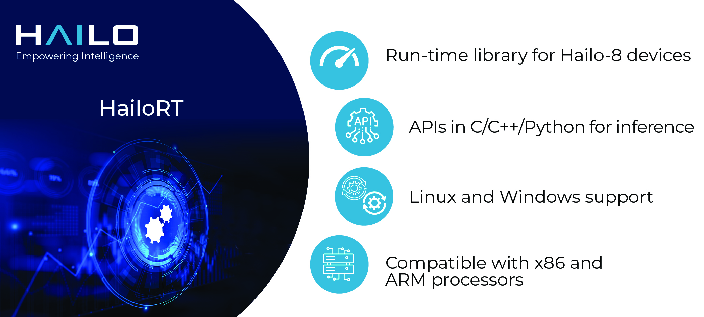

  

# HailoRT #

HailoRT is a light-weight and production-grade run-time library, which runs on the host processor, and
implements a robust user-space run-time library (HailoRT Library) responsible for operating a Hailo device, with intuitive APIs in C/C++ for optimized performance.

HailoRT is comprised of the following main components:
- HailoRT Library.
- HailoRT CLI - command line application used to control the Hailo device, run inference using the device,
 collect inference statistics and device events, etc.
- [**HailoRT PCIe Driver**](https://github.com/hailo-ai/hailort-drivers) - the device driver used to manage the Hailo device, communicate with the device and transfer
    data to/from the device. The PCIe driver includes the Hailo-8 firmware that runs on the Hailo device, manages the boot and control of the Hailo device.
- pyHailoRT - HailoRT Python API (wraps the run-time library)
- HailoRT GStreamer element (HailoNet).

HailoRT supports Linux and Windows, and can be compiled from sources to be integrated with various x86 and ARM processors.

## Usage

See [**hailo.ai developer zone documentation**](https://hailo.ai/developer-zone/documentation/hailort/latest/) (registration is required for  full documentation access).

For compilation instructions, see  [**Compiling HailoRT from Sources**](https://hailo.ai/developer-zone/documentation/hailort/latest/?sp_referrer=install/install.html#compiling-from-sources).

For HailoRT API examples - see [**HailoRT examples**](https://github.com/hailo-ai/hailort/tree/master/hailort/libhailort/examples).

## Changelog

See [**hailo.ai developer zone - HailoRT changelog**](https://hailo.ai/developer-zone/documentation/hailort/latest/?sp_referrer=changelog/changelog.html) (registration required).

## Licenses

HailoRT uses 2 licenses:
- libhailort, pyhailort & hailortcli - distributed under the [**MIT license**](https://opensource.org/licenses/MIT)
- hailonet (GStreamer plugin)  -  distributed under the [**LGPL 2.1 license**](https://www.gnu.org/licenses/old-licenses/lgpl-2.1.txt)

## Contact

Contact information and support is available at [**hailo.ai**](https://hailo.ai/contact-us/).

## About Hailo-8™

Hailo-8 is a deep learning processor for edge devices. The Hailo-8 provides groundbraking efficiency for neural network deployment.
The Hailo-8 edge AI processor, featuring up to 26 tera-operations per second (TOPS), significantly outperforms all other edge processors.
Hailo-8 is available in various form-factors, including the Hailo-8 M.2 Module.

The Hailo-8 AI processor is designed to fit into a multitude of smart machines and devices, for a wide variety of sectors including Automotive, Smart Cities, Industry 4.0,
Retail and Smart Homes.

For more information, please visit [**hailo.ai**](https://hailo.ai/).
